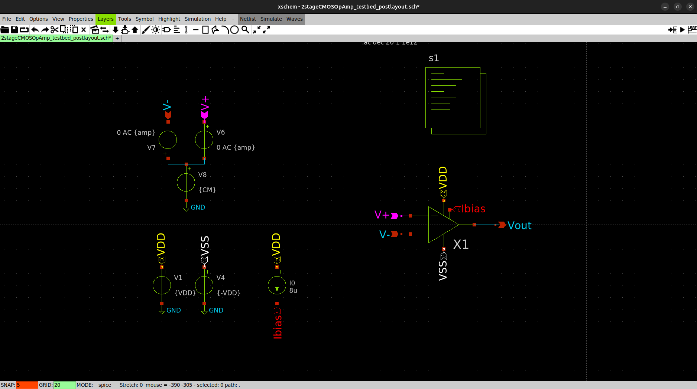

# Data Collection and Analysis
Different design iterations were tested. In particular, I was curious about how the value of the Miller capacitor could affect the frequency response and performance of the op amp.

In the first design, I chose a Miller capacitor of 3pF, but when I started the layout, I decided this value was too unecessarily large, hence I switched to 0.5pF

In iteration #3 i also tested what would happen if tail current was higher than what the Miller cap determined it to be. For example for Miller cap of 0.45pF, tail current should be 4.5uA but I went and tested it with a tail current of 5uA to see what would happen

Finally I tested my circuit post layout to see how it would be affected.

## Iterations
1. Miller C = 3pF, tail current = 30uA
2. Miller C = 0.5pF, tail current = 5uA
3. Miller C = 0.45pF, tail current = 5uA
4. Miller C = 0.8pF, tail current = 8uA
5. Miller C = 0.8pF, tail current = 8uA, post layout, with parasitic elements

## Collection
For each design iteration I was interested in 4 things:
1. the frequency response of the opamp, under 'GainvsFreq'
2. the open loop repsonse of the op amp
3. what some samples waves across different gain and freq values would look like
4. the slew rate of the op amp

#### Frequency Response
To get the frequency response, I tested the op amp in a non-inverting amplifier configuration. I tested gain of 1 and, 100 to at least 700 with steps of 100, and then tested the "max" gain of the op amp in the non-inverting amplifier configuration.

- To set the unity gain of the op amp, I used it in a buffer configuration.
- To set the gain of the op amp, I fixed R1 at 1k and varied R2 from 99k to 699k with steps of 100k.
- To get the "max" gain, I just used R2 of 999k

#### Open Loop Response
To get the open loop response, I fed equal but opposite signals into the op amp's inverting and noninverting inputs. The signals are sine waves with a bias of 0.8V and an amplitude of 1V (although this amplitude doesnt really matter)

#### Sample Waves
For the samples waves, I wanted a snapshot of what the output would look like at different gains and frequencies. The op amp was placed in a noninverting amplifier configuration and sine wave was fed to the noninverting input. This sine wave has a bias of 0V and had its amplitude varied according to the gain so the op amp would never hit its voltage limits.

I mainly tested 6 different settings:
1. Amplitude=10mV, Gain=100dB, Freq=1k
2. Amplitude=10mV, Gain=100dB, Freq=10k
3. Amplitude=2.5mV, Gain=400dB, Freq=1k
4. Amplitude=2.5mV, Gain=400dB, Freq=10k
5. Amplitude=1.3mV, Gain=700dB, Freq=1k
6. Amplitude=1.3mV, Gain=700dB, Freq=10k

#### SR
To get the slew rate characteristics, I just kept it in buffer configuration and fed it a square pulse of 1ms across a period of 2ms.

## Analysis
### Miller C = 3pF, tail current = 30uA
With the original value of 3pF, the frequency response looked like below

The maxmimum gain is probably around 57dB, BW is around 4MHz, SR is around 9V/us

### Miller C = 0.5pF, tail current = 5uA
#### Freq Response
But as mentioned before, this was too large and I wanted to use a smaller Miller cap value. So I started with 0.5pF

Note that this time I also tested for a gain of 10dB and 50dB, for whatever reason.

The maximum gain is 58.5dB, BW is around 4.5MHz.

#### Samples Waves
This was also the first time I looked at samples waves across different gains and frequencies. I noticed that a negative DC offset appeared within the output of the op amp. This negative DC offset seemed to increase as gain increased, but was more or less indifferent to changes in frequency. I also noticed some choppy waves tips which I thought was a problem but later learned that this was due to my sample rate when collecting simulation data being too low.

*Amplitude=2.5mV, Gain=400dB, Freq=10k, note the choppy waves are due to simulation sample rate, not any circuitry issue*

*Amplitude=2.5mV, Gain=400dB, Freq=1k*

#### SR

The slew rate ended up about 7V/us, which was not very nice. But more importantly, while looking at the slew rate I noticed that the output of the op amp had spikes on the edges of the square waves. This spikes were relatively huge too, about 0.05V for a 1V square wave. Upon closer inspection, this was a result of instability. This wasn't really a surprise since I had reduced Miller compensation by so much.

Hence the tradeof: If we increase Miller comp, we increase stability, but at the cost of BW and device size.

### Miller C = 0.45pF, tail current = 5uA
With a slightly lower Miller comp value, we get pretty much the same results. However, I tested this with a tail current of 5uA rather than 4.5uA. This increased slew rate from 7V/us to 8V/us, and increased maxmimum closed loop gain from 58.5dB to 59.6dB.

This is of course, no surprise.

### Miller C = 0.8pF, tail current = 8uA
I then increased MillerC until the spiking and instability problems were much smaller, which happened at 0.8pF. Most of the characteristics were pretty much the same:
- Maximum closed loop gain decreased by 0.04dB
- Maximum open loop gain decreased by 1.5dB
- BW decreased by 0.5MHz

But 2 characteristics that changed significantly were
- Slew rate decreased by 2V/us to 6V/us
- Spiking decreased from 0.05V to 0.01V

Ultimately I chose to go with this because I hated seeing the spiking in square waves. The drop in slew rate, although significant, was not going to affect me in any way unless I needed to use this op amp for sine waves at frequencies > 0.95MHz

### Miller C = 0.8pF, tail current = 8uA, post layout
Finally, I redid the tests for the circuit post layout. I then compared the data pre and post layout to see how the performance of the op amp would be affected. Overall, no significant impact was present, with the only visible change being that the negative DC offset for output waves in the 'Sample Waves' test was slightly larger.

*Amplitude=10mV, Gain=100dB, Freq=10k*

*Amplitude=2.5mV, Gain=400dB, Freq=10k, note the slight increase in DC offset after layout*

*Frequency response at a gain of 100dB*

*Frequency response at a gain of 700dB*

*Slew rate response*

# Summary
| Iteration                 | Max Closed Loop Gain (dB) | BW (MHz)  | SR (V/us) |
| ------------------------- | ------------------------- | --------- | --------- |
| C_m = 3pF, Tail I = 30uA  | 57                        | ~4        | ~9        |
| C_m = 0.5pF, Tail I = 5uA | 58.5                      | ~4.5      | ~7        |
| C_m = 0.45pF, Tail I = 5uA| 59.6                      | ~4.5      | ~8        |
| C_m = 0.8pF, Tail I = 8uA | 59.2                      | ~4.5      | ~6        |

1. Miller C = 3pF, tail current = 30uA
2. Miller C = 0.5pF, tail current = 5uA
   This led to a much smaller slew rate (9V/us to 7V/us), and spikes in square wave outputs due to instability from a reduced Miller compensation
3. Miller C = 0.45pF, tail current = 5uA
    Increasing the tail current above what it calculated value is leads to an increase in slew rate from 7V/us to 8V/us, and increased maxmimum closed loop gain from 58.5dB to 59.6dB.
4. Miller C = 0.8pF, tail current = 8uA
   Finally, I increased the Miller compensation until the spiking on the square wave outputs were virtually gone. This however, led to a dro pin SR until 6V/us, and a drop in BW by 0.5MHz.
5. Miller C = 0.8pF, tail current = 8uA, post layout, with parasitic elements
   Finally I did my postlayout sim to see how the charactersitics would be affected by parasitics. Everything seemed, for the most part the same. The only significant difference was frequency response past the first 2 poles (?)

As Miller compensation decreases, so does SR, along with the stability of the system (as can be seen from the spiking appearing when C_m is decreaased). The drop in SR can be somewhat counteracted by increasing tail current independent of Miller compensation. A decrease in Miller compensation increases the BW.